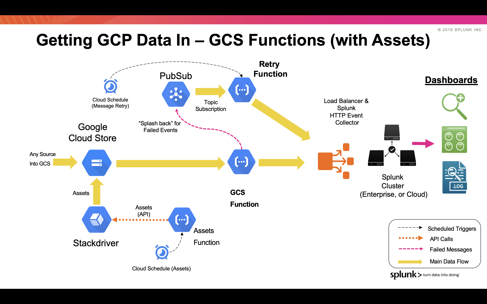

# GCP Functions Library for Ingesting into Splunk

**Assets Functions**

This function periodically requests Assets inventory configurations (API Call) and publishes it to a GCS Bucket. The GCS Function can then ingest this content into Splunk via HEC.
The trigger for the Assets function would be done by a Cloud Schedule trigger to a PubSub Topic.

The assets function will push an event type of google:gcp:assets by default. This sourcetype is provided in the props.conf file

Any messages that failed to be sent to HEC are sent into a PubSub topic for retry. A recovery function will attempt to resend periodically.

This function requires Cloud Assets API to be enabled on the Project you will be requesting the Asset inventory from.

