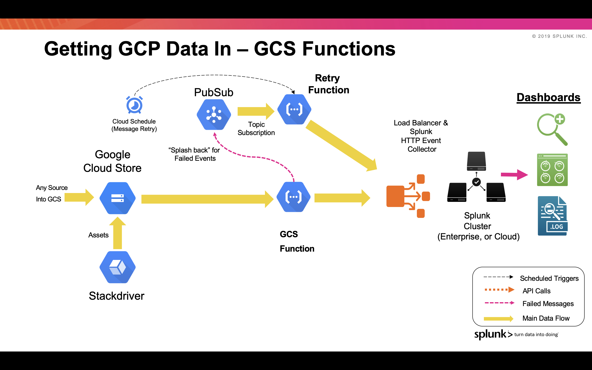

# GCP Functions Library for Ingesting into Splunk

**Google Cloud Storage**

This function triggers on objects being written to a GCS Bucket. The bucket is set in when defining the function settings. All of the contents from the bucket is sent to HEC in batches of events – an event delimiter/breaker regex should be set in a function environment variable so that the function can break up the batches in the appropriate places. The batches are formed so that it can achieve an even event distribution across indexers (otherwise all of the content would go into 1 indexer). Code variables can be configured within the template to adjust the batch size. The Splunk HEC token should be created with the appropriate sourcetype for the events, as well as the index, as the events are not re-formatted/procecessed in any way.
Any messages that failed to be sent to HEC are sent into a PubSub topic for retry. A recovery function will attempt to resend periodically.

Note- 
Due to the memory capacity limits for GCP Functions, this function has a limitation of sending log files that are smaller than 1GB. Log files larger than 1GB will cause the function to exit with a memory limit exceeded.

