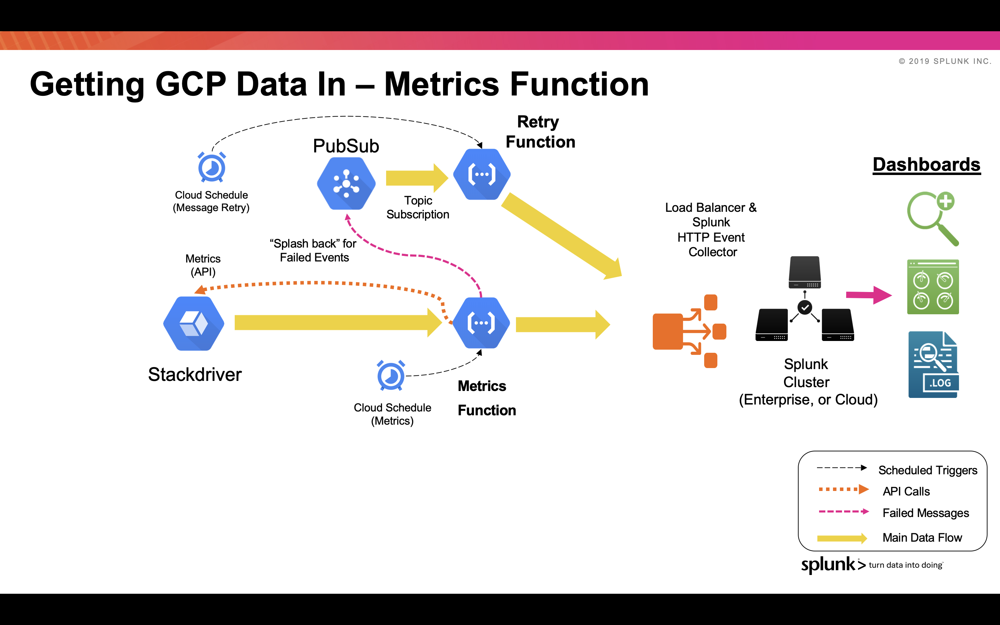

# GCP Functions Library for Ingesting into Splunk

**Metrics Function**

This function is triggered by a Cloud Scheduler trigger (via PubSub). The function calls Stackdriver Monitoring APIs to retrieve the metrics (metrics request list, and poll frequency set in environment variable). These metrics are then sent to Splunk HEC. Two formats are supported - one to be compatible with the Add-on for GCP, sending the metrics as events into Splunk, the second is sent as a metric into Splunk's Metrics index.
As with the PubSub Function, any failed messages are sent into a PubSub topic for retry. A recovery function will attempt to resend periodically. 

