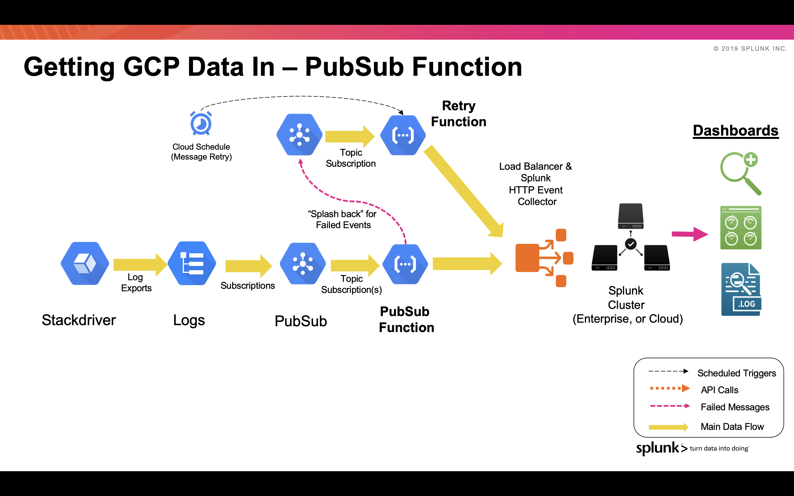

# GCP Functions Library for Ingesting into Splunk

**PubSub Function**

This function pulls any event that is posted into PubSub and packages it up into a Splunk event. The event is then sent to the Http Event Collector (HEC). The function is written such that the event format can be sent compatible with Splunk's Add-On for Google Cloud Platform (https://splunkbase.splunk.com/app/3088/).
If any faiures occur during sending the message to HEC, the event is posted back to a Pub-Sub Topic. A recovery function is provided which is executed via a Cloud Scheduler trigger (PubSub). The recovery function will attempt to clear out the PubSub retry topic and send these events into HEC.

